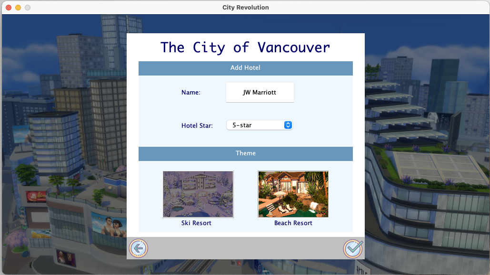

# City Evolution - Term Project for UBC CPSC 210

## Some Screenshots

*Source: pictures used in this application were taken from the web*

## Proposal

### What will this application do?

This application is a simulation of building a 2-D city. Users/players act as the planner and leader of a city and build
it from scratch. Players can choose to add a variety of 'contents' to a city such as **hotels, restaurants, grocery
stores and residents** to build a successful town. Players will also implement the functionality of each content so that
their cities ara almost like real!

### Who will use this application?

- Players interact with this application to build a city.

### Why is this project of interest to me?

I have always been a fan of simulation games on Steam and enjoyed the immersive experience of building a life and living
out many aspects of it, so I hope to design such a project where I can control what goes on behind the screens.

## User Stories

- As a user, I want to be able to create a city.
- As a user, I want to be able to add contents to my city such as hotels and residents.
- As a user, I want to be able to select a content that I have added to my city and manipulate its functionality. For
  example, with a hotel, I want to be able to hire residents as staff, create hotel rooms, book residents into hotel
  rooms, etc.
- As a user, I want to be able to view all the contents that I have added to a city, and view the status of each content
  that I have created. For example, I want to be able to see information about each of my residents, or the room booking
  status of a hotel.
- As a user, I want to be able to make my residents work at the businesses that I have created and earn money. Employees
  should automatically receive their wages in their bank accounts.
- As a user, I want to be able to save all the contents of my city into a JSON file.
- As a user, I want to be given an option to load a JSON file to restore all contents that I have created.
